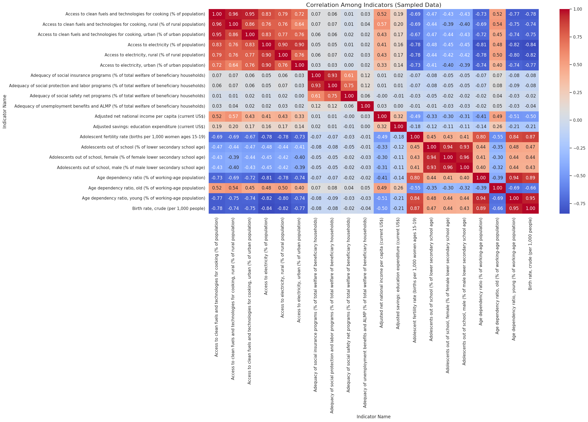
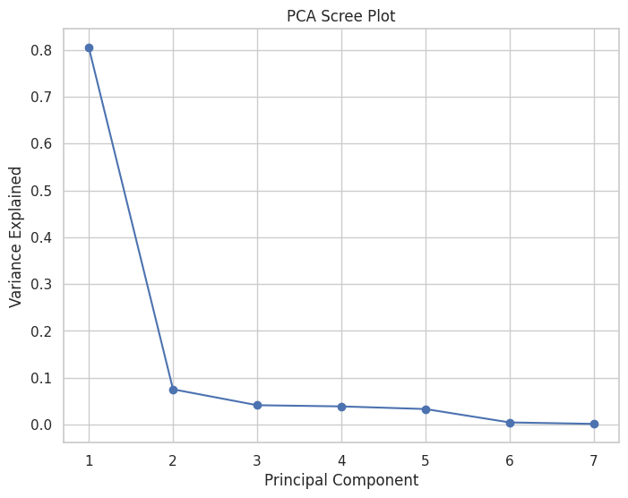
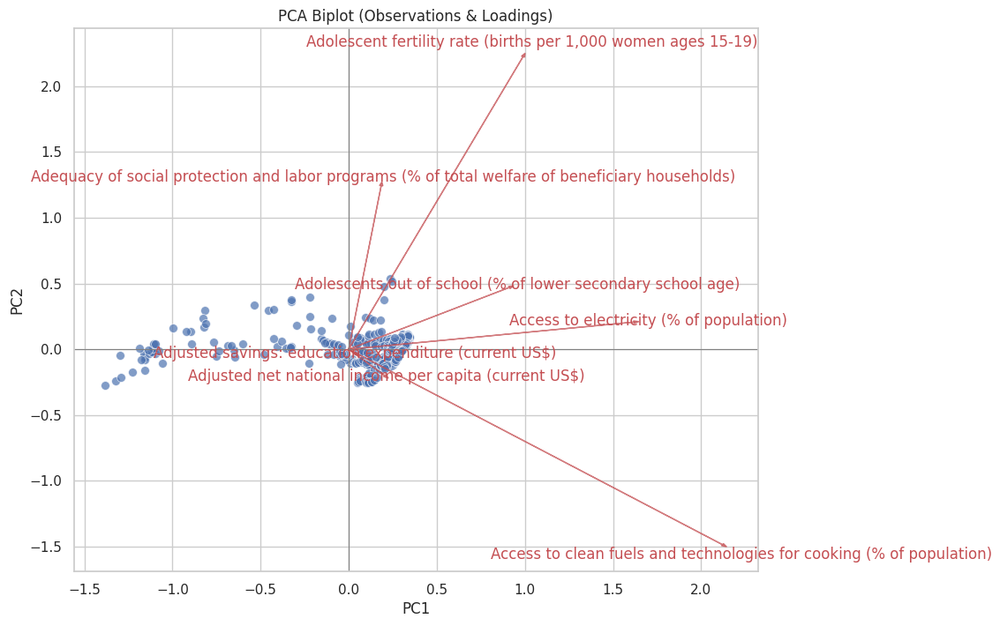
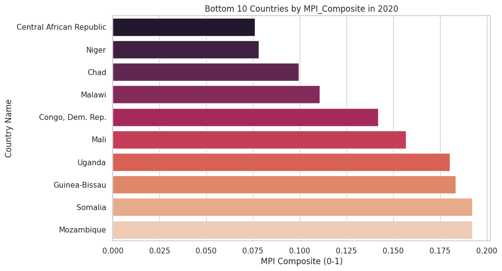

# CxC-Hackathon

# SAP Sustainability & Multidimensional Poverty Index (MPI) Challenge Submission

---

## Table of Contents
1. [Introduction](#introduction)  
2. [Data and Methodology](#data-and-methodology)  
3. [Index Construction](#index-construction)  
4. [Key Insights and Results](#key-insights-and-results)  
5. [Policy Recommendations](#policy-recommendations)  
6. [References](#references)

---

## 1. Introduction

In our project, we set out to address the complex challenge of multidimensional poverty using advanced data science techniques. Our goal was to build a composite index that captures critical aspects of development—including infrastructure, economic well-being, health, and education—across more than 150 countries from 2000 to 2023.  

Starting with a dataset containing **87 indicators**, we carefully selected a subset of **seven key indicators** that best represent the dimensions of poverty. Our work is inspired by global best practices and aligned with SAP’s ambitious sustainability targets, such as achieving net zero emissions by 2030, diverting 100% of e-waste from landfills, and increasing workforce diversity. This submission outlines our methodology, results, and actionable policy recommendations for driving sustainable development.

---

## 2. Data and Methodology

### Dataset Overview
- **Coverage:** 150+ countries, 2000–2023  
- **Indicators:** 87 in total, spanning various aspects of development  
- **Key Fields:** Country Name, Country Code, Indicator Name, Topic, and annual measurements

### Data Transformation Process
1. **Reshaping the Data:**  
   - **Melted** the wide-format dataset into a long format with columns: *Country, Indicator, Year, Value*.  
   - **Pivoted** the long format into a wide format so that each *(Country, Year)* pair has its own set of indicator values.
   
2. **Visual Exploration:**  
   - Generated a **correlation heatmap** to explore relationships among indicators.  
     
      
---

## 3. Index Construction

### Indicator Selection
From the original 87 indicators, we identified the following **seven key indicators** that capture essential dimensions of poverty:

1. **Access to clean fuels and technologies for cooking (% of population)**
2. **Access to electricity (% of population)**
3. **Adequacy of social protection and labor programs (% of total welfare of beneficiary households)**
4. **Adjusted net national income per capita (current US$)**
5. **Adjusted savings: education expenditure (current US$)**
6. **Adolescent fertility rate (births per 1,000 women ages 15–19)**
7. **Adolescents out of school (% of lower secondary school age)**

These indicators reflect:
- **Infrastructure and Living Conditions** (clean fuels and electricity)
- **Social Safety Nets** (social protection programs)
- **Economic Well-being** (national income, education expenditure)
- **Health and Education** (adolescent fertility and school enrollment)

### Data Preparation
- **Normalization:** Applied **MinMax scaling** (0–1) to each chosen indicator.
- **Inversion:** Negative indicators (adolescent fertility rate and adolescents out of school) were inverted so that higher values uniformly represent better outcomes.

### Composite Index Calculation
The **MPI_Composite** is computed as the arithmetic mean of the scaled indicators:

> **MPI_Composite = (Scaled Indicator₁ + Scaled Indicator₂ + … + Scaled Indicator₇) / 7**

This transparent calculation provides a straightforward measure of multidimensional poverty, laying the groundwork for further refinements if needed.

---

## 4. Key Insights and Results

### Principal Component Analysis (PCA)
- **Explained Variance:**  
  - **PC1:** 80%  
  - **PC2:** 8%  
  - **PC3–PC7:** Minimal contribution (each ≤ 4%)

- **Interpretation:**  
  The dominance of PC1 indicates that a single composite dimension—largely driven by infrastructure (clean fuels and electricity) and health/education metrics—captures most of the variance among countries.

### Correlation Analysis
The correlation of each indicator with **MPI_Composite** is as follows:
- **Access to clean fuels:** 0.864  
- **Access to electricity:** 0.845  
- **Adolescent fertility rate:** 0.791  
- **Adolescents out of school:** 0.773  
- **Adjusted net national income per capita:** 0.647  
- **Adequacy of social protection:** 0.363  
- **Adjusted savings: education expenditure:** 0.252  

*These results highlight that improvements in energy access and reductions in negative health/education outcomes are critical drivers of overall development.*

### Country Rankings
For the year **2020**, our analysis identified the following bottom 10 countries based on MPI_Composite scores:

| **Country Name**             | **MPI_Composite** | **Policy Proposals**                                                                                                                                              |
|------------------------------|-------------------|-------------------------------------------------------------------------------------------------------------------------------------------------------------------|
| Central African Republic     | 0.07607           | For Central African Republic, focus on: Promote clean cooking technologies & household energy solutions; Improve rural electrification & power infrastructure.   |
| Niger                        | 0.07805           | For Niger, focus on: Promote clean cooking technologies & household energy solutions; Improve rural electrification & power infrastructure.                     |
| Chad                         | 0.09941           | For Chad, focus on: Promote clean cooking technologies & household energy solutions; Improve rural electrification & power infrastructure.                      |
| Malawi                       | 0.11072           | For Malawi, focus on: Promote clean cooking technologies & household energy solutions; Improve rural electrification & power infrastructure.                    |
| Congo, Dem. Rep.             | 0.14195           | For Congo, Dem. Rep., focus on: Promote clean cooking technologies & household energy solutions; Improve rural electrification & power infrastructure.          |
| Mali                         | 0.15674           | For Mali, focus on: Promote clean cooking technologies & household energy solutions; Improve rural electrification & power infrastructure.                      |
| Uganda                       | 0.18029           | For Uganda, focus on: Promote clean cooking technologies & household energy solutions; Improve rural electrification & power infrastructure.                    |
| Guinea-Bissau                | 0.18338           | For Guinea-Bissau, focus on: Promote clean cooking technologies & household energy solutions; Improve rural electrification & power infrastructure.             |
| Somalia                      | 0.19230           | For Somalia, focus on: Promote clean cooking technologies & household energy solutions; Improve rural electrification & power infrastructure.                   |
| Mozambique                   | 0.19232           | For Mozambique, focus on: Promote clean cooking technologies & household energy solutions; Improve rural electrification & power infrastructure.               |

---

## 5. Policy Recommendations

Based on our data-driven insights and in line with global best practices, we propose the following interventions for countries with the lowest MPI_Composite scores:

### **Expand Clean Cooking and Electrification**
- **Clean Cooking Solutions:**  
  - Partner with initiatives such as the Global Alliance for Clean Cookstoves to distribute affordable, energy-efficient stoves.
- **Rural Electrification:**  
  - Invest in decentralized renewable energy systems (e.g., microgrids, solar home systems) to improve electricity access in remote areas.

### **Enhance Maternal Health and Reproductive Education**
- **Reproductive Health Services:**  
  - Implement comprehensive sexual and reproductive health programs, in line with WHO guidelines, to reduce adolescent fertility.
- **Healthcare Infrastructure:**  
  - Strengthen maternal health services and primary healthcare, especially in underserved regions.

### **Improve Education Access and Quality**
- **Reduce Dropout Rates:**  
  - Adopt measures inspired by UNESCO’s Education for All initiatives, such as scholarship programs and fee reductions.
- **Teacher Training:**  
  - Enhance training programs to improve the quality of education, ensuring that curricula meet the needs of modern economies.

### **Strengthen Social Protection Systems**
- **Social Safety Nets:**  
  - Expand cash transfer programs, unemployment benefits, and vocational training initiatives, following frameworks recommended by the World Bank.
- **Inclusive Policies:**  
  - Develop policies that protect vulnerable populations and encourage broad-based economic participation.

These recommendations are designed to address specific challenges identified in our analysis and are rooted in internationally recognized best practices.

---

## 7. References

1. **SAP Integrated Report 2023 – Environmental Performance:** [https://www.sap.com/integrated-reports/2023/en/environmental-performance.html](https://www.sap.com/integrated-reports/2023/en/environmental-performance.html)  
2. **SAP Sustainability – Zero Emissions, Zero Waste & Zero Inequality:** [https://www.sap.com/products/sustainability/our-approach.html](https://www.sap.com/products/sustainability/our-approach.html)  
3. **SAP Policies, Ethics, & Compliance – Sustainability Reporting and Policies:** [https://www.sap.com/products/sustainability/our-approach/reporting-and-policies.html](https://www.sap.com/products/sustainability/our-approach/reporting-and-policies.html)  
4. **SAP Diversity & Inclusion:** [https://www.sap.com/about/diversity.html](https://www.sap.com/about/diversity.html)  
5. **SAP 2022 Diversity and Inclusion Report:** [https://www.sap.com/documents/2023/04/4e7e324b-6e7e-0010-bca6-c68f7e60039b.html](https://www.sap.com/documents/2023/04/4e7e324b-6e7e-0010-bca6-c68f7e60039b.html)  
6. **Why SAP is Doubling Down on DEI Commitments:** [https://diginomica.com/why-sap-doubling-down-dei-commitments-face-wider-industry-backlash](https://diginomica.com/why-sap-doubling-down-dei-commitments-face-wider-industry-backlash)  
7. **SAP Investor Relations – Supervisory Board:** [https://www.sap.com/investors/en/governance/supervisory-board.html](https://www.sap.com/investors/en/governance/supervisory-board.html)  
8. **SAP Sustainability Report 2023:** [https://www.sap.com/corporate/en/integrated-report.html](https://www.sap.com/corporate/en/integrated-report.html)  
9. **SAP Sustainability Strategy:** [https://www.sap.com/about/sustainability.html](https://www.sap.com/about/sustainability.html)  
10. **SAP Corporate Social Responsibility:** [https://www.sap.com/corporate/en/sustainability.html](https://www.sap.com/corporate/en/sustainability.html)  
11. **SAP Press Release on Net Zero:** [https://news.sap.com/2022/04/sap-accelerates-net-zero-strategy/](https://news.sap.com/2022/04/sap-accelerates-net-zero-strategy/)  
12. **SAP Circular Economy and E-Waste Initiatives:** [https://www.sap.com/products/sustainability/circular-economy.html](https://www.sap.com/products/sustainability/circular-economy.html)  
13. **SAP Sustainability Innovation:** [https://www.sap.com/products/sustainability/innovation.html](https://www.sap.com/products/sustainability/innovation.html)  
14. **SAP Social Impact Initiatives:** [https://www.sap.com/about/sustainability/social.html](https://www.sap.com/about/sustainability/social.html)  
15. **SAP Environmental Management (ISO 14001):** [https://www.sap.com/products/sustainability/environmental-management.html](https://www.sap.com/products/sustainability/environmental-management.html)  
16. **SAP Corporate Governance Report:** [https://www.sap.com/investors/en/corporate-governance.html](https://www.sap.com/investors/en/corporate-governance.html)  
17. **SAP Integrated Sustainability Metrics:** [https://www.sap.com/investors/en/sustainability.html](https://www.sap.com/investors/en/sustainability.html)  
18. **SAP Sustainability Blog:** [https://www.sap.com/about/sustainability/sap-sustainability-blog.html](https://www.sap.com/about/sustainability/sap-sustainability-blog.html)  
19. **SAP Sustainable Impact Overview:** [https://www.sap.com/about/sustainability/impact.html](https://www.sap.com/about/sustainability/impact.html)  
20. **SAP Annual Report 2023:** [https://www.sap.com/investors/en/financial-reports.html](https://www.sap.com/investors/en/financial-reports.html)

---

**Thank you for considering our submission.**  
We believe that our integrated, data-driven approach not only provides a robust measure of multidimensional poverty but also offers actionable insights and policy recommendations that can drive meaningful change. Our work is designed to support sustainable development and reflects the innovative spirit needed to meet the challenges of our time.
